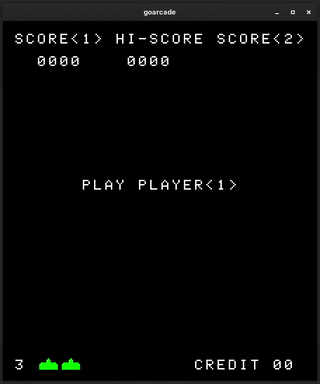

# goarcade

An arcade game emulator based on the Intel 8080 CPU, written in Golang. It can play classic arcade games like [1978 Space Invaders](https://en.wikipedia.org/wiki/Space_Invaders).



- Passes common 8080 CPU tests
- Timing accurate (CPU @ 2MHz, UI @ 60Hz)
- Performance optimized, uses <10% of a CPU core (tested on a Ryzen 5 2600 CPU) when running at 2MHz
- SDL3 UI without needing CGo using [zyko0/go-sdl3](https://github.com/Zyko0/go-sdl3)
- Comprehensive CLI interface
- Audio support (numbered WAV files: 0.wav, 1.wav...)
- Pause, reset, save states

TODO:

- [x] Read MAME .zip archives
- [x] Game name in save state file name
- [x] Code for supporting other games (sound file mappings, i/o, memory mappings)
- [ ] Create config structure for gamespecs (add support for games without rebuild)
- [ ] Make all IO ports configurable as gamespec
- [ ] Help screen to show controls

## Usage

No game ROM included, do your own research :)

```bash
# Download dependencies
> go mod download

# Build emulator
> go build

# Help
> ./goarcade --help
NAME:
   goarcade - Intel 8080 arcade emulator

USAGE:
   goarcade [global options] [command [command options]] [rom path (binary file or .zip archive)]

COMMANDS:
   dasm, d  disassemble a program
   help, h  Shows a list of commands or help for one command

GLOBAL OPTIONS:
   --pprof, -p                    run pprof webserver on localhost:6060
   --state string                 save state file
   --debug, -d                    print debug logs
   --headless                     run without UI window
   --sound-dir string, -s string  directory path for WAV sound files
   --no-audio                     run without audio
   --cpm                          run in CP/M compatibility mode (for CPU tests)
   --unthrottle, -u               do not throttle cpu at 2MHz
   --help, -h                     show help

# Example: running space-invaders with sound
./goarcade ./roms/invaders/invaders.zip -s ./roms/invaders/sounds
```

## Controls

- `c`: add a coin
- `1`: 1 player
- `2`: 2 players
- `left arrow`: player left
- `right arrow`: player right
- `left ctrl`: player shoot
- `p`: pause
- `r`: reset
- `0`: save state in game directory (<game_name>.state)
- `9`: load state

## Test results

Test outputs below are directly generated by a [GitHub workflow](https://github.com/cterence/goarcade/actions/workflows/golang-integration.yaml).

<!-- TEST_OUTPUT_START -->
```txt
=== RUN   Test_CPU
=== RUN   Test_CPU/TST8080.COM
    main_test.go:28: Output from TST8080.COM:
        MICROCOSM ASSOCIATES 8080/8085 CPU DIAGNOSTIC
         VERSION 1.0  (C) 1980

         CPU IS OPERATIONAL
=== RUN   Test_CPU/8080PRE.COM
    main_test.go:28: Output from 8080PRE.COM:
        8080 Preliminary tests complete
=== RUN   Test_CPU/CPUTEST.COM
    main_test.go:28: Output from CPUTEST.COM:

        DIAGNOSTICS II V1.2 - CPU TEST
        COPYRIGHT (C) 1981 - SUPERSOFT ASSOCIATES

        ABCDEFGHIJKLMNOPQRSTUVWXYZ
        CPU IS 8080/8085
        BEGIN TIMING TEST
        END TIMING TEST
        CPU TESTS OK
=== RUN   Test_CPU/8080EXM.COM
    main_test.go:28: Output from 8080EXM.COM:
        8080 instruction exerciser
        dad <b,d,h,sp>................  PASS! crc is:14474ba6
        aluop nn......................  PASS! crc is:9e922f9e
        aluop <b,c,d,e,h,l,m,a>.......  PASS! crc is:cf762c86
        <daa,cma,stc,cmc>.............  PASS! crc is:bb3f030c
        <inr,dcr> a...................  PASS! crc is:adb6460e
        <inr,dcr> b...................  PASS! crc is:83ed1345
        <inx,dcx> b...................  PASS! crc is:f79287cd
        <inr,dcr> c...................  PASS! crc is:e5f6721b
        <inr,dcr> d...................  PASS! crc is:15b5579a
        <inx,dcx> d...................  PASS! crc is:7f4e2501
        <inr,dcr> e...................  PASS! crc is:cf2ab396
        <inr,dcr> h...................  PASS! crc is:12b2952c
        <inx,dcx> h...................  PASS! crc is:9f2b23c0
        <inr,dcr> l...................  PASS! crc is:ff57d356
        <inr,dcr> m...................  PASS! crc is:92e963bd
        <inx,dcx> sp..................  PASS! crc is:d5702fab
        lhld nnnn.....................  PASS! crc is:a9c3d5cb
        shld nnnn.....................  PASS! crc is:e8864f26
        lxi <b,d,h,sp>,nnnn...........  PASS! crc is:fcf46e12
        ldax <b,d>....................  PASS! crc is:2b821d5f
        mvi <b,c,d,e,h,l,m,a>,nn......  PASS! crc is:eaa72044
        mov <bcdehla>,<bcdehla>.......  PASS! crc is:10b58cee
        sta nnnn / lda nnnn...........  PASS! crc is:ed57af72
        <rlc,rrc,ral,rar>.............  PASS! crc is:e0d89235
        stax <b,d>....................  PASS! crc is:2b0471e9
        Tests complete
--- PASS: Test_CPU
    --- PASS: Test_CPU/TST8080.COM
    --- PASS: Test_CPU/8080PRE.COM
    --- PASS: Test_CPU/CPUTEST.COM
    --- PASS: Test_CPU/8080EXM.COM
PASS
```
<!-- TEST_OUTPUT_END -->

[Source for the tests](https://github.com/superzazu/8080/tree/274ffd700b81baabea99b0963bc1260b67132185/cpu_tests)

## Profiling

- Use the `-p` flag to start the profiling webserver

  ```bash
  ./goarcade -p [...]
  ```

- In another shell, use `go tool pprof` to start profiling

  ```bash
  go tool pprof http://localhost:6060/debug/pprof/profile?seconds=30
  ```

- Use `top`, `web` or `png` commands in the repl to explore the results

## References

- [8080 Datasheet](https://deramp.com/downloads/intel/8080%20Data%20Sheet.pdf)
- [Pastraiser's 8080 opcode table](https://pastraiser.com/cpu/i8080/i8080_opcodes.html)
- [superzazu/8080 emulator](https://github.com/superzazu/8080)
- [Computer Archeology](https://www.computerarcheology.com/Arcade/SpaceInvaders/Hardware.html)
- [emulator101.com](https://web.archive.org/web/20240118230905/http://www.emulator101.com/welcome.html) (via web.archive.org)
